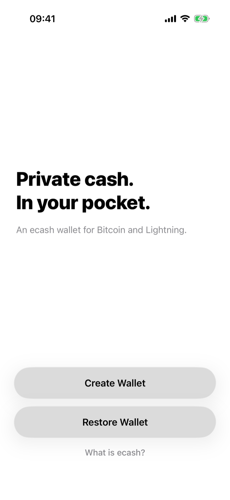
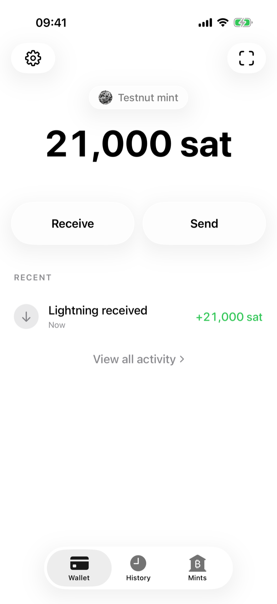
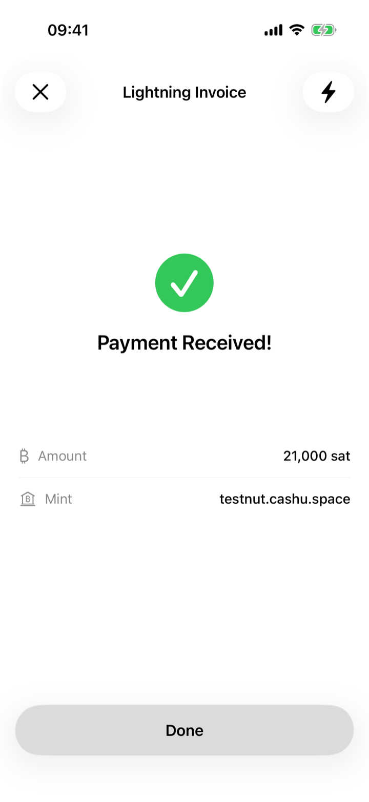
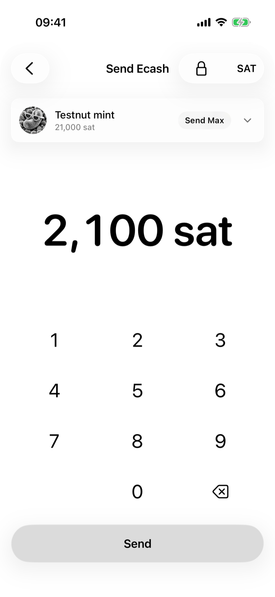
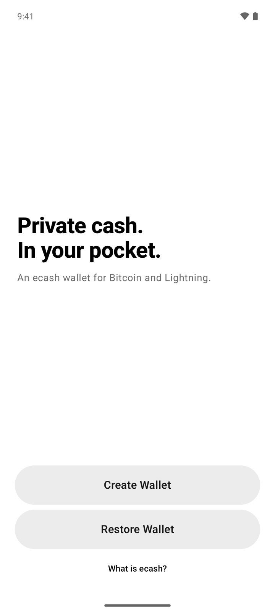
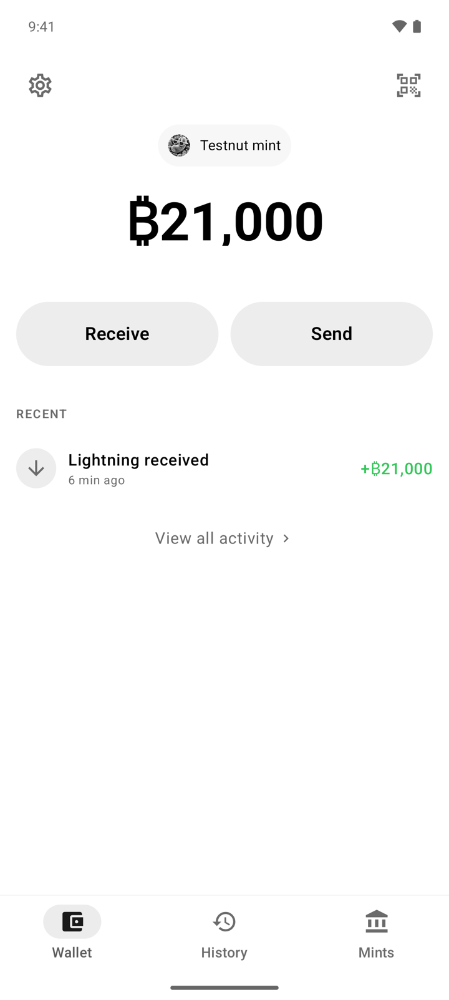
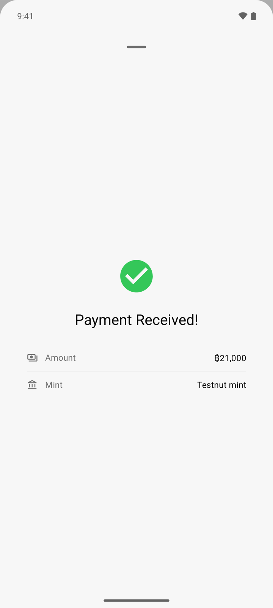
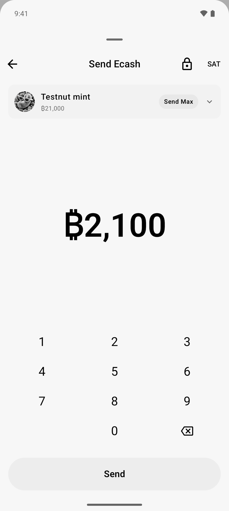

# Cashu Wallet

Native Cashu ecash wallets for iOS and Android.

Cashu is Bitcoin-backed ecash: a mint issues bearer tokens against sats
deposited over Lightning, and payments between wallets are private by design —
the mint does not learn who pays whom. Cashu Wallet wraps that model in a
first-class native app on each platform — SwiftUI on iOS, Jetpack Compose on
Android — with the same surfaces, copy, and behavior on both.

iOS on the first row, Android on the second — same journey on both platforms:

| Onboarding | Wallet | Receive | Send |
| :---: | :---: | :---: | :---: |
|  |  |  |  |
|  |  |  |  |

The full capture set for both platforms — onboarding through settings — lives
in [`docs/screenshots/`](docs/screenshots/). All shots show a test wallet
funded from the public [Testnut mint](https://testnut.cashu.space); the
balances are not real sats.

## Features

- **Ecash** — hold sats as Cashu tokens; send and receive them as QR codes or
  copyable strings, without touching a Lightning channel.
- **Lightning** — fund the wallet and pay invoices through the mint, with
  BOLT11 invoices and BOLT12 offers.
- **On-chain Bitcoin** — receive to and send from mints that support it.
- **Cashu Requests (NUT-18)** — publish a reusable, address-shaped payment
  request that senders pay over Nostr relays, without leaking your mint or
  balance to anyone watching a single endpoint.
- **NFC contactless** — tap-to-pay ecash between devices.
- **Locked ecash (P2PK)** — lock a send to the recipient's key so only they
  can redeem it.
- **Multi-mint** — add mints by URL or QR, discover public mints, and keep
  per-mint balances visible.
- **Nostr Wallet Connect** — let other apps spend from the wallet with scoped
  permissions.
- **Backup & restore** — BIP-39 seed phrase backup and restore, plus an App
  Lock behind the platform's biometrics.

## Repository layout

- `ios/` — SwiftUI app, Xcode project, unit + UI tests, helper scripts.
  Targets iOS 18+.
- `android/` — Kotlin / Jetpack Compose app and Gradle project.
  `minSdk 26`, `targetSdk 36`.
- `docs/product/` — shared product, design, and copy contracts both apps
  implement. Platform notes live in `docs/ios/` and `docs/android/`.
- `CI/` — local mint infrastructure for integration tests: Nutshell and CDK
  mints running a FakeWallet Lightning backend, so end-to-end payment flows
  run without a real Lightning node.

Both apps are built on the [Cashu Dev Kit](https://github.com/cashubtc/cdk)
(CDK) through its native FFI bindings.

## Building

iOS (requires Xcode with the iOS 18+ SDK):

```sh
cd ios
xcodebuild -project CashuWallet.xcodeproj \
  -scheme CashuWallet \
  -destination 'platform=iOS Simulator,name=iPhone 17 Pro' \
  build
```

Android (requires JDK 17 and an Android SDK; point `local.properties` or
`ANDROID_HOME` at it):

```sh
cd android
./gradlew --no-daemon :app:assembleDebug
```

## Testing

Unit tests:

```sh
# iOS
cd ios && xcodebuild test -project CashuWallet.xcodeproj -scheme CashuWallet \
  -destination 'platform=iOS Simulator,name=iPhone 17 Pro' \
  -only-testing:CashuWalletTests

# Android
cd android && ./gradlew --no-daemon :app:testDebugUnitTest
```

Integration tests run the apps against real mint implementations started
locally — see [`CI/README.md`](CI/README.md) for the full setup:

```sh
./CI/setup-nutshell.sh && ./CI/start-nutshell.sh
./CI/setup-cdk.sh && ./CI/start-cdk.sh
```

## License

[MIT](LICENSE)
