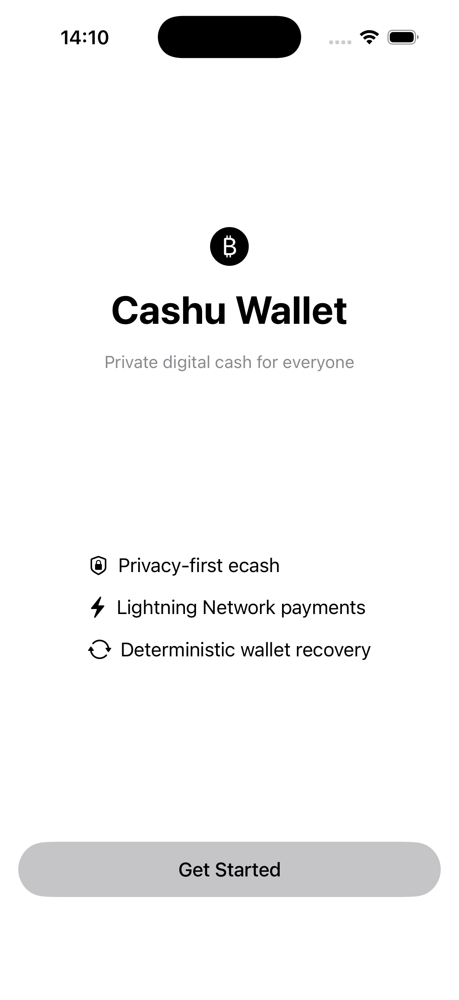
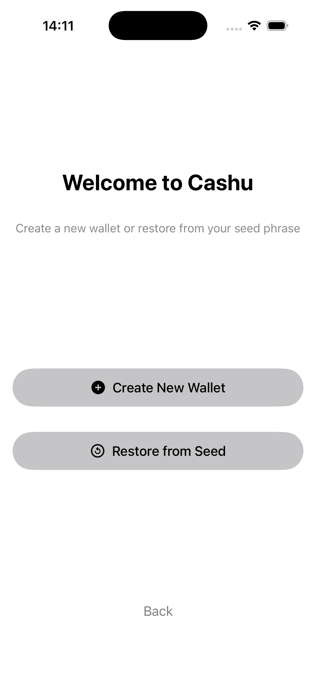
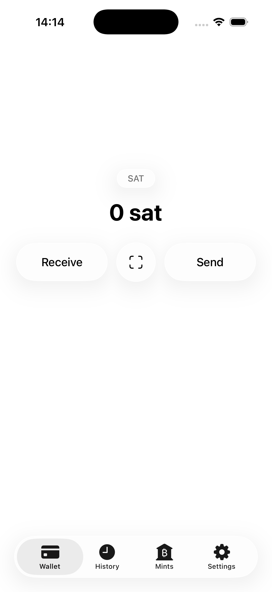
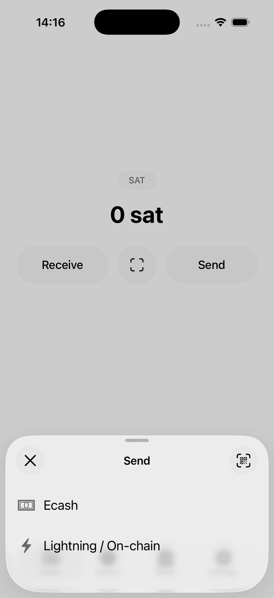
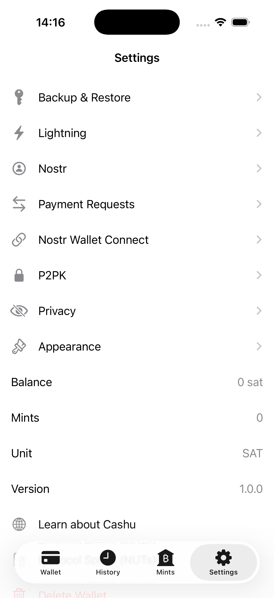
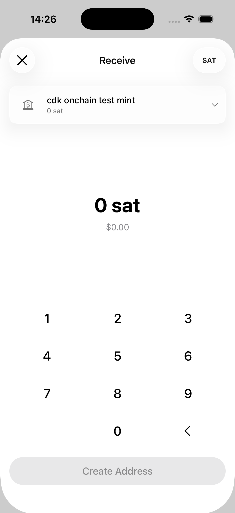
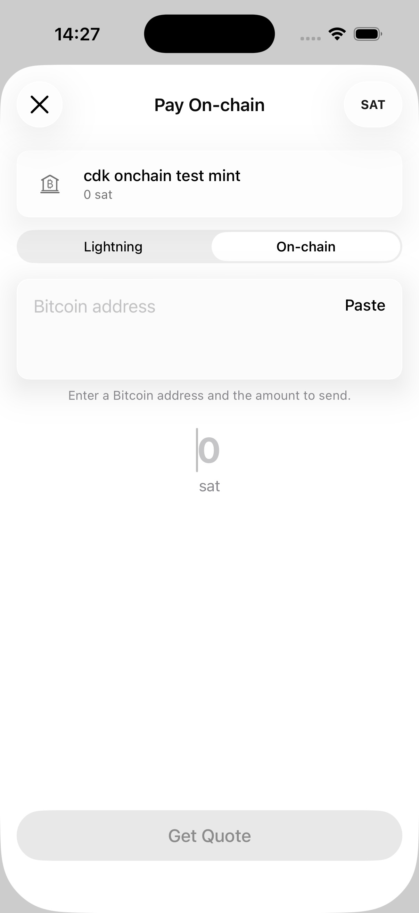

# Cashu Wallet iOS

A privacy-first iOS wallet for Cashu ecash and the Lightning Network, with on-chain Bitcoin support and NFC contactless payments.

Built with SwiftUI, targets iOS 18+, and uses [cdk-swift](https://github.com/asmogo/cdk-swift) (the Cashu Dev Kit) under the hood.

## Features

- **Ecash** — mint, send, and redeem Cashu tokens across multiple mints
- **Lightning** — pay and receive BOLT11 invoices, with Lightning Address support
- **On-chain** — send to and receive from regular Bitcoin addresses
- **Contactless (NFC)** — tap-to-pay using NDEF tags; receive ecash by tap on eligible iPhones with HCE enabled
- **Nostr** — NWC (Nostr Wallet Connect), payment requests, and NPC integration
- **P2PK** locking, multi-mint discovery, and deterministic recovery from seed
- Backup & restore from BIP-39 seed phrase

## Screenshots

| Launch | Onboarding | Wallet |
| :---: | :---: | :---: |
|  |  |  |

| Send options | Settings |
| :---: | :---: |
|  |  |

| Receive on-chain | Send on-chain |
| :---: | :---: |
|  |  |

## Building

Open `ios/CashuWallet.xcodeproj` from the repository root, or open
`CashuWallet.xcodeproj` from this folder, in Xcode 16+ and run on an iOS 18
simulator or device. Swift Package Manager resolves `cdk-swift` automatically.

For a CLI build to the simulator from this folder:

```sh
xcodebuild -project CashuWallet.xcodeproj \
  -scheme CashuWallet \
  -destination 'platform=iOS Simulator,name=iPhone 17 Pro' \
  build
```

## Project layout

- `CashuWallet/App` — app entry point and root view
- `CashuWallet/Core` — services (wallet, mints, NFC, Nostr, keychain), navigation, settings
- `CashuWallet/Views` — SwiftUI views grouped by flow (Send, Receive, Mints, History, Settings)
- `CashuWallet/Models` — data types and protocols

## Receiving by tap (HCE)

Open **Receive → Ecash**, set an amount, then choose **Receive by Tap** and
hold the payer's device near the top of the iPhone. The system presents Apple's
contactless sheet. The same action is available when reopening a request in
History. It is hidden in Simulator, ordinary builds, and on ineligible devices.

The payer reads a transport-free NUT-18 request and writes the token back using
the NFC Forum Type 4 / Numo protocol, matching Android. The shared QR retains its
Nostr transport. NFC accepts text, URI token links, and binary Cashu MIME records.
Tokens are saved before the final write is acknowledged. Known-mint tokens are
redeemed through the existing wallet operation coordinator and attributed to the
request. Unfamiliar mints open the existing token review screen; **Review Later**
keeps the token in History. Tokens with a wrong amount, unit, or mint are saved
for review without fulfilling the request. Failed claims remain recoverable there.

Unlike Android, iOS deliberately requires review of unfamiliar mints rather than
automatically converting their tokens into the default mint. Future automatic
conversion would need a separate implementation of Android's fee limits and
settlement recovery. NFC availability also differs because Apple restricts HCE.

### Signing and availability

Apple's [HCE entitlement](https://developer.apple.com/support/hce-transactions-in-apps/)
requires approval for the app's bundle ID and AID `D2760000850101`. Apple's
eligibility requirements apply; setting a region or adding an entitlement file
does not grant access. This app still targets iOS 18+, above CardSession's iOS
17.4 minimum. HCE cannot be exercised in Simulator.

After Apple approves the entitlement, enable it for the App ID, regenerate the
development/distribution profiles, and build with the supplied configuration:

```sh
xcodebuild -project CashuWallet.xcodeproj -scheme CashuWallet \
  -destination 'generic/platform=iOS' -xcconfig HCE.xcconfig build
```

For Xcode, set the app target's `CASHU_HCE_ENABLED` to `YES` and
`CODE_SIGN_ENTITLEMENTS` to `CashuWallet/CashuWalletHCE.entitlements` for the
approved configuration. Apply the same configuration when archiving. Ordinary
builds keep their existing entitlements so developers without HCE approval can
still build and sign. The app also checks `CardSession.isSupported` and
`CardSession.isEligible` before offering the action. It does not register as the
default contactless app or start on field detection/double-click.

### Verification

`NFCReceiveTests` covers request encoding, APDU selection/read/write, both NLEN
write orders, missing chunks, reconnect resets, malformed NDEF, binary records,
and request terms. `NFCReceiveLifecycleTests` covers cancellation, stale sessions,
review, and failed claims. These tests run in Simulator without HCE approval.
`NFCReceiveIntegrationTests` uses the [CI fake mint](../CI/README.md) to create
real test tokens, transfer them in text and binary APDUs, redeem them, and verify
that a duplicate cannot credit twice.

Before shipping an HCE build, use an entitled physical iPhone and an Android or
Macadamia payer to verify:

- Fixed-amount receipt at a known mint, with credited amount and linked History.
- New-mint review, Review Later, app restart, and claim from History.
- Wrong amount/unit/mint, offline redemption, and duplicate delivery.
- Both text and binary token writes, including a token larger than one APDU.
- Separation during a write, retap, native-sheet cancellation/timeout, background,
  request edits, and a second receipt on a reusable request.
- No contactless action on an ineligible device; ordinary NFC sending still works.

### Reference implementation

Investigated Macadamia's
[NFCRequestEmulation.swift](https://github.com/zeugmaster/macadamia/blob/73bf9d378553e8ac37f7137700163606e333b835/macadamia/Wallet/NFCRequestEmulation.swift)
and its RequestView integration on the `release` branch. It uses a foreground
`CardSession`, an optional presentment-intent assertion, and Type 4 tag emulation
to receive an in-band token. This implementation follows that approach while
implementing the protocol from our Android counterpart, with complete-write
tracking, binary token support, persistent recovery, and the wallet's own claim
and mint-review paths.
